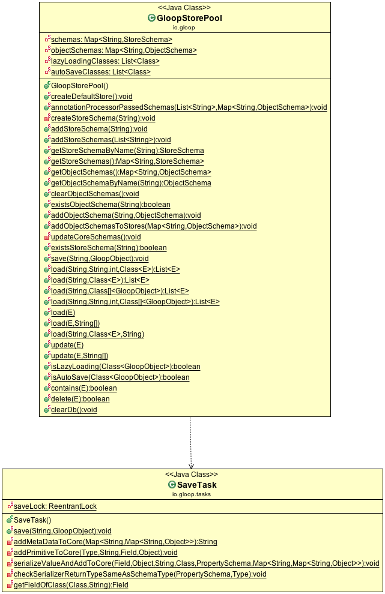

# Save

## Usage

To save an object it has to inherit from GloopObject, then you can simply call the `save` method of the object.

```java
public class Person extends GloopObject {

	private String name;

	@Ignore
	private String secondName;
}
```
All write operations (adding, modifying and removing) should be wrapped in transactions. You don't need to use transactions, but it will improve the speed. Especially when calling more then one save.
To save the Person just simply call:

```java
new GloopTransaction() {
	@Override
   	public void execute() {
		Person person = new Person();
		person.save();
	}
}.start();
```

With the annotation `@Ignore` you can specify if a property is ignored from the SDK. This property is never saved and loaded from the SDK.

With the property `@PrimaryKey` you can specify the primary key of the table.

`@Indexed` says that this property is indexed in the database.

`@Serializer` allows you to set a custom serializer to save the data in a different format. Look at description of serializers.

`@Encrypt` can be used to save something in Base64 encoded.


To ignore the whole class use:

```java
@GloopClass(ignore = true)
public class Person extends GloopObject {
	private String name;
	private String secondName;
}
```

### Save properties
Sometimes we want to save only a few properties instead the whole object.

```java
new GloopTransaction() {
	@Override
   	public void execute() {
		Person person = new Person();
		person.save("name");
		
		person.save("name", "secondName");
	}
}.start();

```
This will save or update only the `name` property of the `Person` object. `objectId` and `metaData` is always saved. You can also pass more then one parameter to save or update all passed properties.

### SaveInBackground
It's also possible to save a GloopObject in a separate thread. This operation on GloopObject is not blocking. SaveInBackground is thread safe.

```java
Person person = new Person();
person.saveInBackground();
```
The person is saved in a background thread. You can't assume that the object is immediately saved in the db, so may if you want to call other operations on the same object you have to know that the object might not be saved.

## Architecture

On the first save of an object the schema is created and passed to the GloopCore.
Then iterate over each property of the object and check if serializer is used or if it is a primitiv type. If a serializer is used, it is checked witch subtype the serializer has and depending on this the right add to core method is called to pass the right primitive type to the core. If it is a normal primitiv type without serializer then the value is passed direct to the core. The objectId and the meta_data field is added separate to the core.


