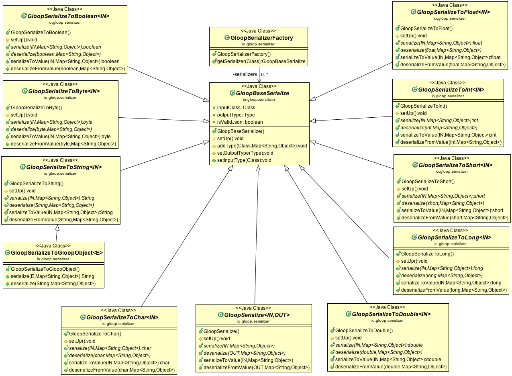
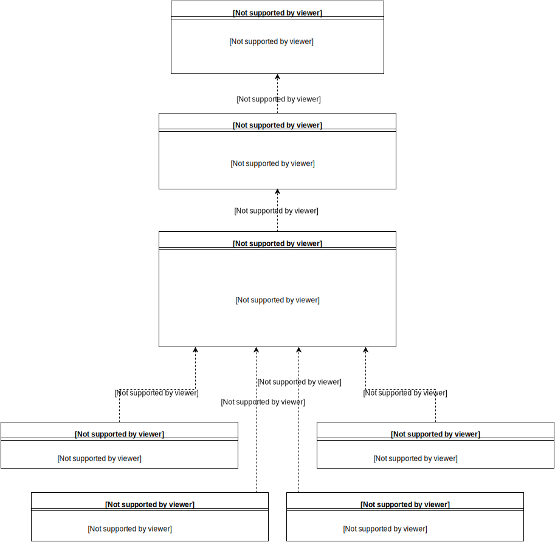
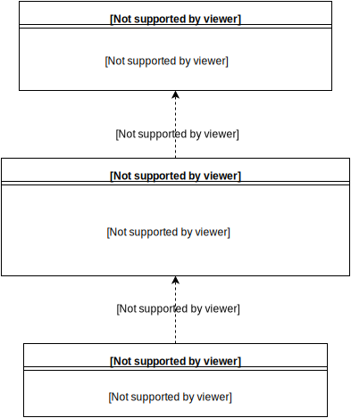

# Serializer

Serializers are used to serialize values to primitive data types or Strings, so that they can be stored in the database. To save custom objects the serializer and deserialize method of a serializer class need to be implemented.    

## Architecture

### IGloopSerializer
Every GloopSerializer implements the IGloopSerializer interface. It's used to make the code in the SDK type save. With the interface it is checked, for example if the class witch is passed is a serializer.

### SchemasBuilder
The schemas of the GloopObjects where build in the annotation processor. The serializers set with the `@Serilaizer(SerializerClass.class)` are set in the annotation processor and passed down to the SDK. The Serializers registered with the GloopSerializerPool, are assigned in the SDK at runtime. The schema is not complete, when it is passed to the SDK. The SchemaBuilder completes it. The classes where no `@Serializer` is set or where the type is not primitive the type of the schema will be `Type.UNKNOWN`. In the SchemaBuilder in the method `checkRegisteredSerializers` these `Type.UNKNOWN` fields where searched to check if there is a serializer registered in the SerializerPool. If yes then the correct type and the serializer_name of the PropertySchema is set. The schema is now complete.

### SerializerUtil
Is a static class with some functions to help find and set serializers.

`getSerializer(PropertySchema propertySchema, Field field)` returns the serializer class for the field. To find the serializer, the schema is used instead of using `@Serializer` annotation because of speed. Every property which has a serializer gets a serializer_name assigned in the PropertySchema.

`dataTypeOfSerializedObject(Class<? extends GloopBaseSerialize> clazz)` returns the type to which the serializer converts to. The type is found with a recursive function witch checks if the superclass is on of the base serializer classes like `GloopSerializeToInt`. If it is one of these classes then the return type is found by comparing the classes.

`getSerializer(Class clazz)` returns the registered serializer in the GloopSerializerPool. This function don't checks the `@Serializer` annotation because it's only used for the `GloopBaseCollectionSerializer` to convert on value of a collection. On a collection it is not possible to set a serializer for an element form the list. This can only be done with the register function of the GloopSerializerPool class.

### GloopSerializerFactory

To create an instance of a serializer the GloopSerializerFactory is used. One object is created and saved in a map. The key of the map is the serializer class. Always the same serializer object is used instead of creating always a new one. Serializers should be only created inside the GloopSerializerFactory.

### GloopSerializerPool

The GloopSerializerPool contains a map with data type as key and the serializer object as value. When save is done the right serializer is searched for the data type.  

The `getSerializer` method of the class returns the right serializer for the passed data type. If the right data type is not assigned the `getSerializer` is called recursive for the subclass of the passed data type class. If the class is found the type and the assigned serializer get saved in the map, so that for the next time the serializer gets found faster. If the subclass is `Object` the `getSerializer` returns null witch means that no serializer is assigned for this type. Objects can only be saved if they have a serializer assigned. GloopObject are also saved with a serializer.

### GloopBaseSerialize

Every GloopSerializerTo... extends the GloopBaseSerialize class. It contains methods which are used from every Serializer. 

`isValidJson` property is by default true. Only GloopSerializeToString is by default false. It is used for saving Collections as JSON string. If the JSON string contains some additional `"` it can be a problem to get the value as JSON because its not a valid JSON string.


To serialize a object to a primitiv data type one of the following Classes need to be extended:

* GloopSerializeToBoolean
* GloopSerializeToByte
* GloopSerializeToChar
* GloopSerializeToFloat
* GloopSerializeToDouble
* GloopSerializeToInt
* GloopSerializeToLong
* GloopSerializeToShort
* GloopSerializeToString

The `serialize` and `deserialize` method of these serializers need to be overridden.

Every serialize and deserialize method has as second parameter an `Map<String, Object> metaData` this can be used to save additional data to the database for deserializing data. In the MetaData class some constants for the key of the map are defined.

### SerializeToGloopObject

The SerializeToGloopObject extends the GloopToStringSerializer. 

Serialize: The save method of the GloopObject is called and it returns the UUID of the GloopObject.

Deserialize: The load method of the object is called and return the result of it.





## CollectionSerializer

The collection serializers are used to serialize collections to JSON strings. 



### GloopBaseCollectionSerializer

Every collection serializer extends the GloopBaseCollectionSerializer.
The `getValue` method of the class can be used to get the value of each element in the collection. It takes an object as parameter and gets the value out of it. If a serializer is used to convert a object than the getValue use this serializer. The return type of getValue is always a string.

To deserialize the string from the database additional data is used from the metaData.

* `type`: The type of the list. Example: `java.lang.ArrayList`  
* `key_meta_data`: meta data for the key values. Every type of the key value of the map is saved. Example: `["java.lang.String","java.lang.String"]`  
* `value_meta_data`: meta data for the value values. The type of every value of the map is saved. Example: `["io.gloop.beans.Cat","io.gloop.beans.Dog"]`  
* `expected_input_type`: The class of the expected type. Example: expected_input_type=io.gloop.beans.Animal, input class of serializer is io.gloop.beans.Cat.  


#### Map, Set and List Serializer

Default serializers for the Map, Set and List Serializers are implemented and registered.

Map, Set and List serializers iterate over all elements int the serialize method and call the toValue method of the GloopBaseCollection class. The output of the serialize method is a JSON array as String.


#### Array Serializer

Array serializer take a Object array as input. In the serialize method is check if the array is a array of primitive elements or a array of objects. If its a array of primitive elements than iterate over all elements and save the value as string. If its a array of objects then iterate over each element and call the getValue method of each element in the list. The output of the serialize method is a JSON array as string.


## Assign serializers

To use a serializer they need to be registered. There are two ways to register serializer:

### Register with gloop object

```java
Gloop gloop = new Gloop(this, "api-key");
gloop.registerSerializer(MyObject.class, MySerializer.class)
```
When serializers are registered with the Gloop object. Every object found with the registered type gets converted with the registered serializer.  

### Register with annotations

Serializers can be registered for only one specific property with annotations.  

```java
@Serializer(MySerializer.class)
private MyObject myObject;
```


## Write custom serializers

To create a custom serializer one of the base primitive type serializers needs to be extended. In the following example the value passed to the serializer is converted to a string. Therefor the `GloopSerializeToString<IN>` needs to be extended. The `IN` is the object from which the value gets serialized to and in which we will deserialize. Next step is to implement the methods `serialize` and `deserialize`. Both have as second parameter a `Map<String, Object> metaData`. In the `serialize` method metaData can be used to store additional values, wich can be helpful to later deserialize the value. In the deserialize method the metaData is filled with the values added in the `serialize` method. 



Example of serializing Date to String.

```java
public class DateSerializer extends GloopSerializeToString<Date> {

    DateFormat  df = new SimpleDateFormat("yyyy-MM-dd'T'HH:mm:ssz");

    @Override
    public String serialize(Date src, Map<String, Object> metaData) {
        TimeZone tz = TimeZone.getTimeZone("UTC");
        df.setTimeZone(tz);
        return df.format(src);
    }

    @Override
    public Date deserialize(String src, Map<String, Object> metaData) {
        Date d = null;
        try {
            d = df.parse(src);
        } catch (ParseException e) {
            GloopLogger.e("Date deserialization exception");
        }
        return d;
    }
}
```

Example of a serializer using the metaData. In this example we have a `Pet` class and two sub classes `Cat` and `Dog`. The `Person` class has a pet property where either a Cat or a Dog is assigned. In this case when serializing the object it is important to save the class of the pet to the metaData because it can be either a Dog or a Cat. When deserializing we can read the property stored in the serialize method to create the correct object. Otherwise informations of the property pet in Person get lost, you can not decide later on if the pet is a Dog or a Cat object. 

```java
public class Person extends GloopObject {
	@Serializer(PetSerializer.class)
	private Pet pet;
}

public class Pet extends GloopObject {
	private String name;
}

public class Cat extends Animal { } 

public class Dog extends Animal { }


public class PetSerializer extends GloopSerializeToString<Pet> {

    @Override
    public String serialize(Pet src, Map<String, Object> metaData) {
   		metaData.put("subClass", src.getClass());
    	return JsonConverter.toJson(src);
    }

    @Override
    public Pet deserialize(String src, Map<String, Object> metaData) {
    	return JsonConverter.fromJson(src, metaData.get("subClass"));
    }
}
```