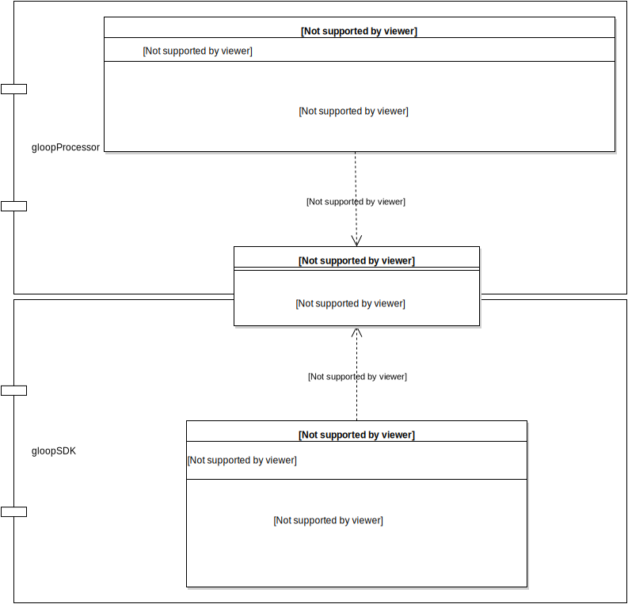
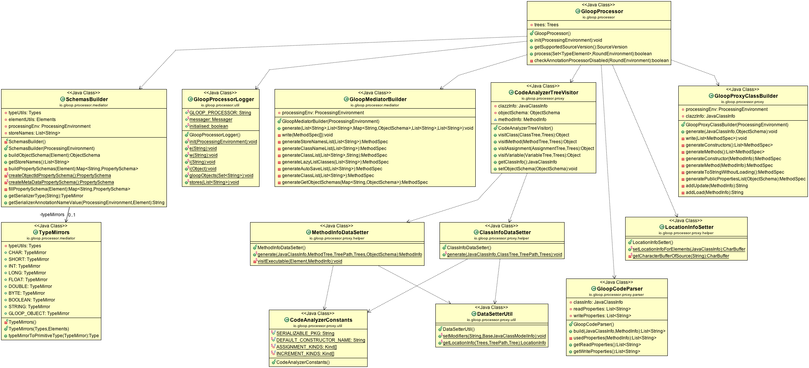

# Annotation Processor

Annotation processor runs at compile time. It is used to find all classes which inherit form GloopObject and to generate the schemas at compile time. To communicate between annotation processor and SDK, classes have to be created from the annotation processor and used at runtime from the SDK. To generate classes the JavaPoet library is used. The created class is called `GloopMediator`.

## Create schemas

The `SchemasBuilder` class in the gloopProcessor module creates the object schemas in the annotation processor. All schema objects and constants are based in the gloopAnnotations module. This module is used of the gloopProcessor and the gloopSDK. Every class inside the gloopAnnotation can be used from both. 

## Speedup some functions

Get the class of a object: To define a class of a object in Java there exist the `getClass()` method. But this method is very slow. To speed up this, the annotation processor generates a Map with the name of the class as key and the Class as value. Calling a get on the map is much cheaper then calling the `getClass()` method. This will work for all classes that extend the GloopObject.

Annotations: Detecting and getting infos of the annotation in Java is very slow. Therefore some methods are generated, in the GloopMediator class, to speed up this. For example finding ignored properties or detecting the different store names that exist.

Get the name of a class: There exist the `getSimpleClassNames()` by passing the class or `getCanonicalClassNames()` by passing the class. And the same the other way round `getClassesForName()` by passing the a class. The native methods of java are not very faster, using this methods this can be done faster.

## Communication between AP and SDK

### GloopMediator

* `getObjectSchemas()` returns the generated object schemas from the annotation processor.
* `getClassNames()` returns a string list with the full name of the classes that inherit from GloopObject.
* `getClassList()` returns a list of classes that inherit from GloopObject.
* `getStoreNames()` returns a string list of all stores used.

### GloopMediatorBuilder

This class takes place in the gloopProcessor module. It uses the JavaPoet library to generate the GloopMediator class. The data is passed to the GloopMediatorBuilder to the generate method. For every passed collection a new method is created to get the data in the SDK.

### GloopMediatorLoader

This class is in the gloopSDK module. It contains a method to load the GloopMediatorClass. The `runMethod(String methodName)` is to run one of the methods of the gloopMediator. The parameter is the name of the method and the return type is `Object`. The return type needs to be casted to the correct collection. The GloopMediatorLoader contains for every method in the GloopMediator a wrapper method.

