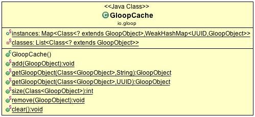

# GloopCache

The cache is used to keep track of created objects. On the load function is checked if a gloop object with the same objectId exists and if then this instance is used instead of creating a new one.

```java
Map<Class<? extends GloopObject>, Map<UUID, GloopObject>> instances
```

All instances are saved in this map. At the creation of the GloopCache the map is prepared: For each class witch extends the gloop object class an extra `WeakHashMap` is created with the key the objectId of the gloop object and a weak reference to the object. The WeakHashMap contains only a weak reference to the object, witch means that if the object is not longer used it can be deleted from the garbage collector even if there exists a reference to the object in the map. On the `finalize` of the gloop object the entry is deleted from the map so that there are only references in the list where an object exists.

- `add(GloopObject object)` adds the gloop object to the instance list. The class of the object passed is the key for the HashMap.
- `getGloopObject(Class<? extends GloopObject> clazz, String objectId)` the class and the objectId as String need to be passed to the get the existing gloop object or null if no object with this id and class is in the map.
- `getGloopObject(Class<? extends GloopObject> clazz, UUID objectId)` the class and the objectId need to be passed to the get the existing gloop object or null if no object with this id and class is in the map.
- `size(Class<? extends GloopObject> clazz)` returns the number of objects in the map for the passed class.
- `remove(GloopObject object)` removes the object from the map.
- `clear()` removes all the instances from the WeakHashMap. The map now still contains the classes as key, the WeakHashMaps are now empty.




# List Cache

References of the list are kept here. If some object calls `save()` or `update()`, the list with the objects from that class are notified that the data has changed. Getting a object from a list will always return the newest version of the object.
