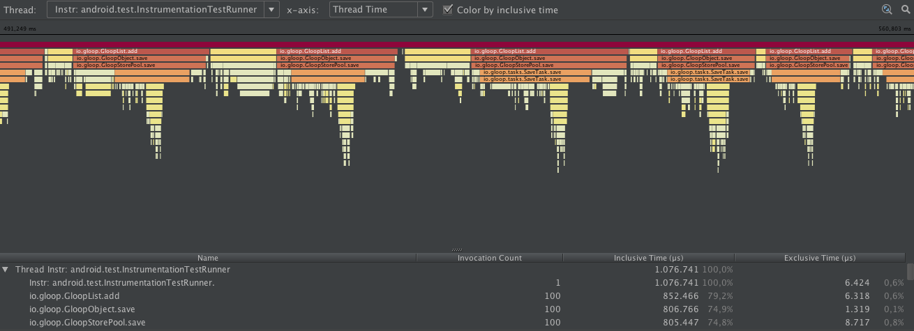

# Publish

## Distribution Package

To create the distribution package use the gradle command from the command line:

```
./gradlew createDistributionPackage
```
or inside Android Studio using the gradle view and calling createDistributionPackage from the gloop group. This will create a folder `distribution` with the libraries to distribute in it. 

## (Work in progress) Repository

This gradle task will help to push the jar to a remote repository on https://bintray.com  therefore is need for a password, witch needs to be set in the local `gradle.property` file.


# Tools

## GloopLogger

GloopLogger allows to print some data to the Android Logcat. Therefor there exists different levels.

* VERBOSE   -> `v()`
* DEBUG     -> `d()`
* INFO      -> `i()`
* WARN      -> `w()`
* ERROR     -> `e()`

For tests inside GloopSDK use:

* TEST      -> `test()` for tests only.

For disabling all test outputs set `PRINT_TEST_INFOS` variable from the `GloopLogger` class to `false` by default it is `true`.

usage:

Passing a string:
```java
GloopLogger.d("Text to print to the log.")
```
or a object
```java
GloopLogger.e(animal)
```
if a object is passed then the toString method of this object is called and printed to the log.

## Print tables to Logcat
With `Gloop.printTable(Person.class)` or by calling `print()` on a GloopList the content of the table in the database is printed to the logcat. The values get not deserialized instead the raw values direct from the database are shown. Using `print()` from the GloopList it is possible to do some queries before.

```java
Gloop.all(Person.class)
	.where()
		.equalsTo("name", "alex")
	.all()
	.print();
```
output:

```
D/GloopSDK: ---------------------------------------
D/GloopSDK: /       name /        age /    friends / 
D/GloopSDK: ---------------------------------------
D/GloopSDK: /       alex /         25 /         [] / 
D/GloopSDK: ---------------------------------------

```

or

```java
Gloop.printTable(Person.class);
```
output:

```
D/GloopSDK: ------------------------------------------------------------------------
D/GloopSDK: /       name /        age /                                    friends / 
D/GloopSDK: ------------------------------------------------------------------------
D/GloopSDK: /       alex /         25 /                                         [] / 
D/GloopSDK: /       test /         30 /   ["c99963f7-b11c-4436-bb24-86601e8b7008"] / 
D/GloopSDK: ------------------------------------------------------------------------

```

## GloopTimingLogger

`GloopTimingLogger` is used to get the usage time of some functions.

```java
GloopTimingLogger timer = new GloopTimingLogger(TAG, LABEL, TimeUnit.MILLISECONDS);

// do something where to track the times

timer.addSplit(LABEL);

// do something else

timer.dumpToLog();
```
When `dumpToLog` is called then there is produced some output on the Android Logcat.

## GloopTestUtils

This class can be used for the tests. Required is to use a rooted virtual device with a shared folder set. This folder can be set in the class.

To copy the database from the device to the developer machine this command can be used:
```java
GloopTestUtils.copyDbToSharedFolder()
```

For deleting the database on the device use:
```java
GloopTestUtils.deleteInternalDb()
```

To call `copyDbToSharedFolder` and `deleteInternalDb` after each test there exist a `tearDown`. If some test cases are implemented then there should be a tearDown method witch calls the `GloopTestUtils.tearDown()`. If the test run on a not rooted and not virtual device then they don't will have any effects.


## GloopProfiler

GloopProfiler is a helpful tool to trace a code about performance. Using this tool it is possible to see how long a method takes and where maybe some speedups can be done. To get the output data from this class there is a need for a rooted virtual device with a shared folder.

```java
GloopProfiler profiler = new GloopProfiler();
profiler.start(NAME_OF_THE_OUTPUT_FILE);

// the code to trace

profiler.stop();
```

This will create a `.trace` file witch can be opened with Android Studio.


