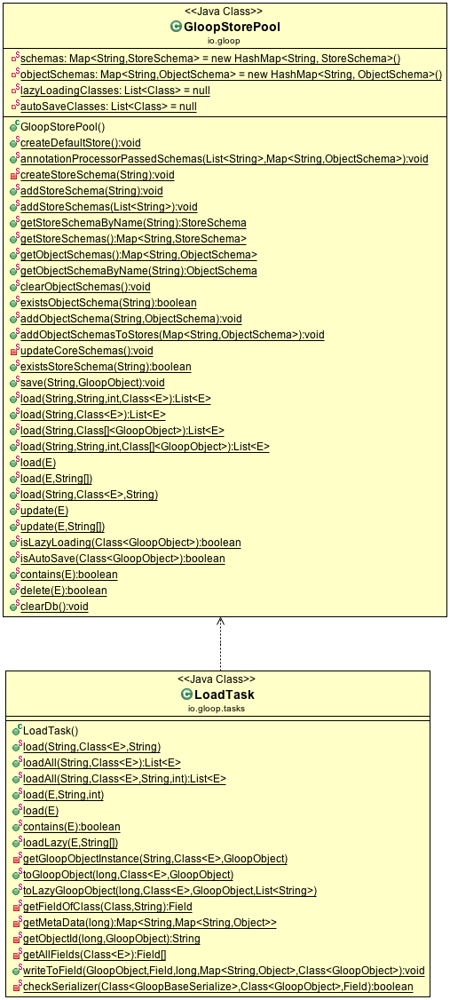

# Load


### All

Load all Objects from the table:

```java
List<Animal> animals = Gloop.all(Animal.class);
```

### One objects

Returns the first object or null if there is none.

```java
Animal animal = Gloop.all(Animal.class).first()
```

### Store

Load all Animal objects from the store "animalStore":

```java
List<Animal> animals = Gloop.all(Animal.class).store("animalStore");
```

### Predicate

#### Gloop predicate

```java
List<Animal> animals = Gloop.all(Animal.class)
							.store("animalStore")
							.where()
								.equals("name", "max")
								.and()
								.equals("age", 2)
							.all();

```

#### Predicate Format SQL

```java
List<Animal> animals = Gloop.all(Animal.class)
							.store("animalStore")
							.predicate("SELECT objectId from Animal where objectId = 'abc'");
```

#### (Work in progress) Predicate Format NS String

Load all Dog and Cat objects where the name == test.

```java
List<Animal> animals2 = Gloop.all(Dog.class, Cat.class)
					 		.store("animalStore")
					 		.where("name == test");
```

Combine conditions with `and` or `or`

```java				 
List<Animal> animals1 = Gloop.all(Dog.class, Cat.class)
					 		.where("name == Alex")
					 		.and()
					 		.where("name != test");
```

## Reload existing object

To reload an existing object instance do:

```java
Animal animal = new Animal();
animal.setName("Alex");
animal.save();

...

animal.load();

```

If you want to load just one specific property do:

```java
Animal animal = new Animal();
animal.setName("Alex");
...
animal.load("name");
```


## Architecture


