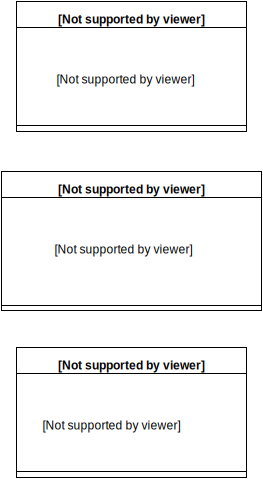

#Schemas

Most parts of the Schemas are created in the Annotation processor and then passed to the SDK. Some parts can't be defined at compile time, so that this parts need to be set at runtime. 
The SDK is much faster by calculating the most parts of the schemas in the annotation processor. This schemas are very important for saving and loading objects from and to the database. The schemas are also passed to core library as JSON. 

## StoreSchema
Using Gloop it is possible to have more then one different store. The `default` store is always created. Stores allow developers to have completely separated databases. 

- path: the path where the database is located
- name: the name of the database
- version: version of the store
- objects: Map of ObjectSchemas, the key is the name of the class and the value is the ObjectSchema.

## ObjectSchema
The ObjectSchema contains informations about the class. It contains a Map of PropertySchemas.

## PropertySchema
Contains informations about the properties of the class. This contains the primitive type which defines the type of the database column. Some more informations about the property are stored. For example if serializer is set or if the property is encrypted.

