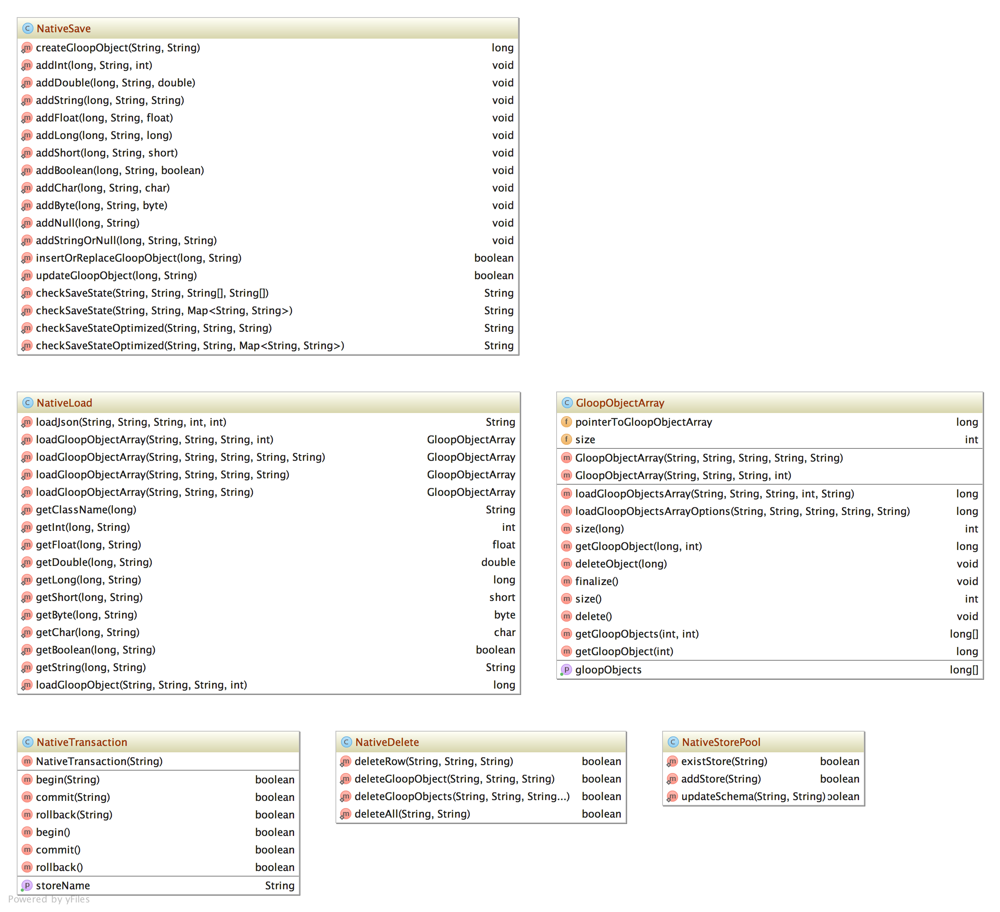
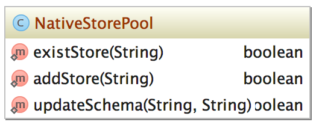
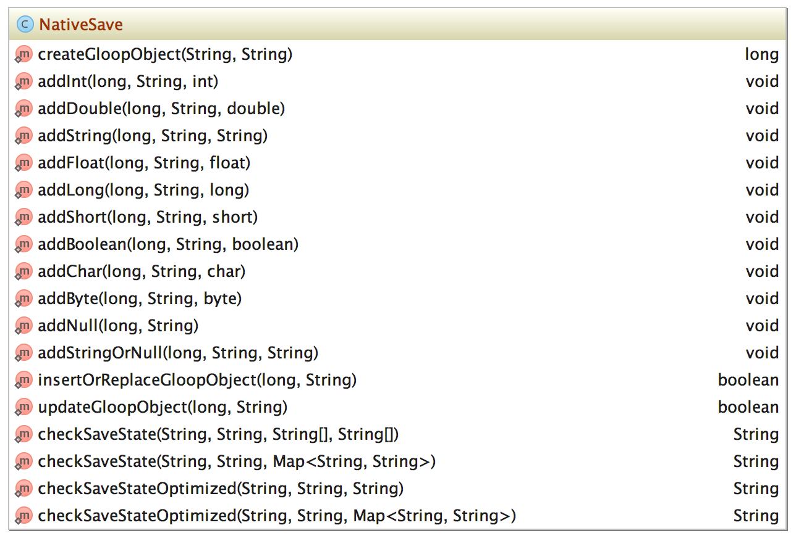
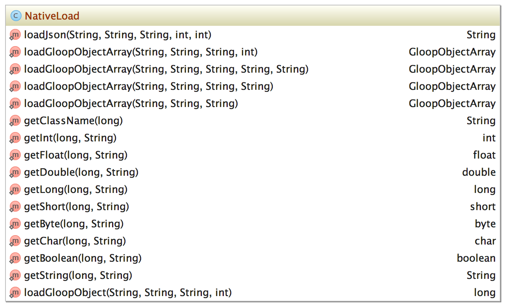
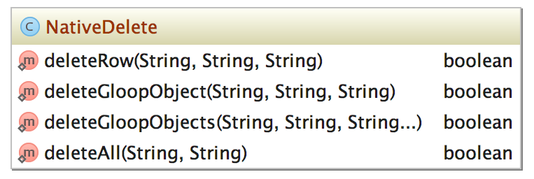
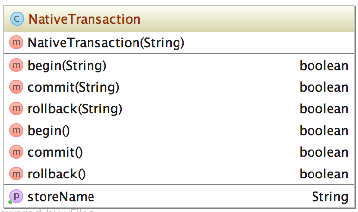

# JNI

The JNI (Java native interface) is used to call c or c++ functions from the java code. The core library for Gloop is written in C++. To use this library in Java the java native interface is used to call the provided C++ functions of the core. 

## Build

To build compile the cpp and header files inside the `jni` folder the gradle script `gloopNdkBuild` can be used. To compile the core library and copy the needed libraries to the jniLibs Folder the gradle script: `compileAndCopyGloopCore` can be called.

## Store Pool

`NativeStorePool` is used to add or update stores. To add a store, the schema is passed down as JSON string. The same with updateSchema the store name and the new schema as JSON string need to be passed to the method.

<!---->

## Save

The `NativeSave` class of the core package is used to save gloopObjects.

<!---->

`createGloopObject(String name)` creates a gloopObject in the c++ part of JNI. 

Then every primitive data type is passed. Example of integer:

`addInt(String propertyName, int value)` with this method, the integer value can be passed to the core without converting it. The name of the property and the integer value need to be passed. 

The same with every other primitive data type and string.

When every value of the gloopObject is passed to the core with the add methods, the `boolean saveGloopObject(String storeName)` method can be called to finally save the gloop object in the sqlite database. The name of the store needs to be passed to save the object in the right database. True is returned when everything goes fine, otherwise false returns. The object gets deleted when the object is saved.

## Load

The `NativeLoad` class of the core package is used to load gloopObjects from the core to the java objects.

<!---->

`loadGloopObjectArray(String storeName, String className, String predicate, int predicateFormat)` returns a GloopObjectArray with a list of pointers inside, which point to a gloopObject in the core. 

With the `getGloopObject(int position)` method, a pointer to the gloopObject at the position is returned and can be used to load the primitive types directly without casting them.

Then, the `NativeLoad` class contains a method for every primitive data type and String. For example with integer: 

`int getInt(long gloopObject, String fieldName)` to get the int value of the gloopObject, the pointer to the gloopObject and the name of the field need to be passed. The method returns the value of this gloopObject and the property name.

The same with every other primitive data type and string.

The gloopObjectArray in the c++ code is deleted when the `finalize` of the java GloopObjectArray is called.

The load of the JNI is thread safe.

## Delete

The `NaticeDelete` class is used to delete objcts from the table in the core. 

- `deleteGloopObject(storeName, className, objectId)` deletes a object from the passed store, the class name and the objectId the unique value of every object.
- `deleteGloopObjects(storeName, className, objectId[])` more then one objectId of one class and store can be deleted at one time.
- `deleteAll(storeName, className)` delete all entries of the passed class and store. 

<!---->

## Transaction

The class `NativeTransaction` allows to create transactions in the core library.

- `NativeTransaction(storeName)` create a new Transaction object.
- `begin()` to start a new transaction.
- `commit()` to call when everything inside the transaction is done.
- `rollback()` to rollback if something went wrong.
- `getStoreName()` to get the name of the store for this transaction.

<!---->

## GloopNativeException
The `GloopNativeException` is thrown whenever a exception occurs in the JNI part of the SDK.