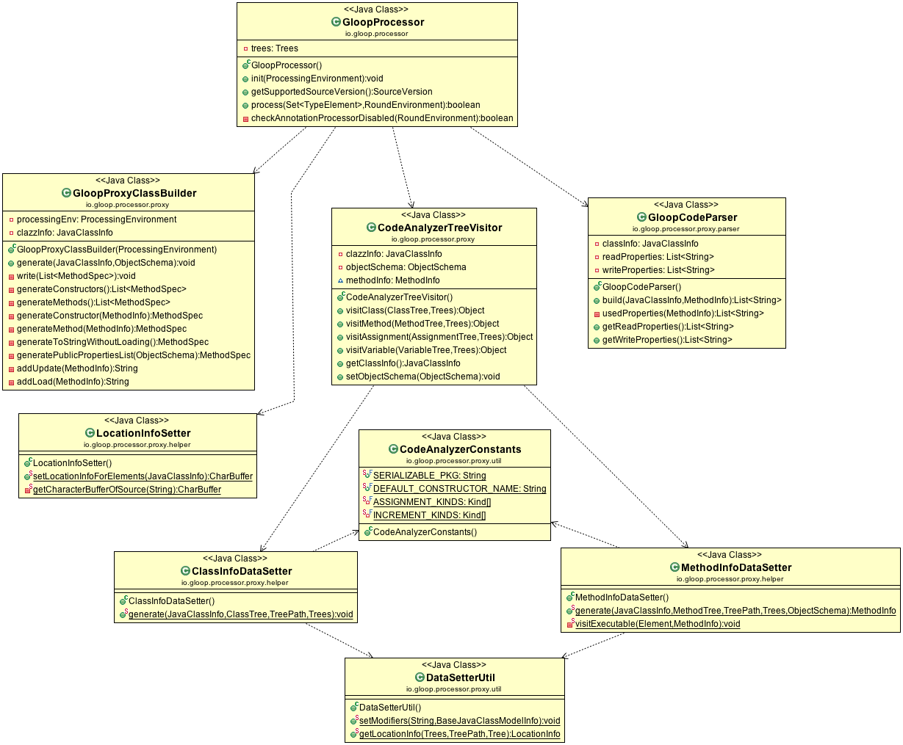
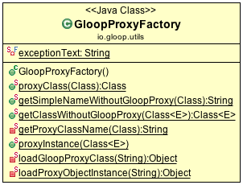

# Lazy Loading for GloopObjects

Lazy loading for GloopObjects is disabled by default, but can be enabled.

When lazy loading is enabled the load function of Gloop will return a proxy class instead the passed class. This proxy class extends the passed class and contains all methods witch pass the call to the original class. If a variable is accessed this variable needs first to be loaded or updated after. 

Original class:

```java
public class Animal extends GloopObject {
	private String name;
	
	public String getName() {
		return name;
	}
	
	public void setName(String name) {
		this.name = name;
	}
}
```
Proxy class:

```java
public class Animal extends GloopObject {
	private String name;
	
	public String getName() {
		GloopStorePool.load(this, "name");
		return super.getName();
	}
	
	public void setName(String name) {
		super.setName(name);
		GloopStorePool.update(this. "name");
	}
}
```

GloopList is returning proxy classes if lazy loading is enabled for this class. 

Full working with:
Every property in the class is private and is set and read only over getter and setters. It can be used some logic in the getter and setter. The method call is passed to the implementation of the developer. Update or load is added. At the moment update and load is added if a property is used in the code. If another method is called inside the getter or setter, then all properties used of this function are added to load and update. On every method call from another class, only the passed parameters can be loaded.

#### Working

For example: A class with this setter and getter will work even if one method is private and called from another setter. Or if the getter reads more than one property.

Original class:

```java
public class Animal extends GloopObject {
	private String name;
	private String secondName;
	
	public String getName() {
		return name;
	}
	
	public String getBoth() {
		return this.name + " " + this.sureName;
	}
	
	public void setName(String name) {
		this.name = name;
		randomSecondName();
	}
	
	private void randomSecondName() {
		this.secondName = "Test";
	}
}
```
Proxy class:

```java
public class Animal extends GloopObject {
	private String name;
	
	public String getName() {
		GloopStorePool.load(this, "name");
		return super.getName();
	}
	
	public String getBoth() {
		GloopStorePool.load(this, "name", "secondName");
		return super.getBoth();
	}
	
	public void setName(String name) {
		super.setName(name);
		GloopStorePool.update(this, "name", "secondName");
	}
}
```
#### Not Working

```java
public class Animal extends GloopObject {
	private String name;
	public static String secondName;
	
	public String getName() {
		return name;
	}
		
	public void setName(String name) {
		this.name = name;
	}
}
```
Accessed like this can not be tracked from the SDK: 

```java
String secondName = Animal.secondName;
```


Not working:

- every static field accessed from outside. Static fields are loaded at the beginning.
- every public field that is accessed without getter and setter. Are loaded at the creation of the object.

### Enable/Disable lazy loading
By default lazy loading is enabled. With the `@GloopClass` annotation lazy loading can be set for a specific class.

```java
@GloopClass(lazyLoading = false)
public class Animal extends GloopObject {
	...
}
```

## Generating Proxy Classes

The following classes are based in the annotation processor and help to build the proxy classes.

### CodeAnalizerTreeVisitor

The `CodeAnalizerTreeVisitor` class allows to visit several parts of the abstract syntax tree. It allows to get information about a class, method ... and to find the source code for the class and it's methods. This is needed to create a proxy classes of a class.


### GloopCodeParser

The `GloopCodeParser` takes as input a method body as string. It checks if the code uses one or more properties of the class. Right now it checks only if the property is used and not if it's a read or write operation. This is needed to find out witch properties have to be loaded or updated.

### GloopProxyClassBuilder

This class helps to build a proxy class for a GloopObject. This class only build's the classes. The data is collected in the CodeAnalizerTreeVisitor, GloopCodeParser and ObjectSchemas and passed to the GloopProxyClassBuilder to generate the classes.



## Load Proxy Classes

To create instances of the generated proxy classes the `GloopProxyFactory` is used. It has also some functions to get the proxy class or the simple name of a proxy class or the simple name without the proxy ending.



## Loading
If lazy loading is active then only the objectId of the GloopObject is loaded. If the GloopObject has some public variables then this ones are loaded to. Only private variables witch are set and loaded by methods can be lazy loaded.

## Saving
Auto save is working for every property accessed with a method. For public properties auto save is not working.


# Lazy Loading for GloopList

The GloopList is a lazy loading list by default. It implements the List interface. 

Usage:

```java
List<Animal> animals = Gloop.all(Animal.class);
``` 
This will return a GloopList instance. At this point no object is loaded. 

If one objet is loaded then the every property of the object is loaded. Only if lazy loading is enabled for this class then only the objectId is loaded. 

The list contains:

- List of classes to load set with `.all(classes)` 
- String storename `.store(name)`
- String predicate `.predicate(predicate)` or `.predicate(predicate, prediacateFormat)` predicateFormat is default SQL 

Not all methods are implemented jet!


# Auto Save

The update function in the GloopStorePool is not implemented. Update statement is needed.

### Enable/Disable lazy loading
By default auto save is disabled. With the `@GloopClass` annotation auto save can be set for a specific class.

```java
@GloopClass(autoSave = true)
public class Animal extends GloopObject {
	...
}
```

### Use

To create an object with lazy loading and auto save the object needs to be created like this: 

```java
Animal animal = Gloop.createObject(Animal.class);
```
or

```java
List<Animal> animals = Gloop.all(Animal.class);
```

Now the `animal` and `animals` are `AnimalGloopProxy` instances that can do auto save and lazy loading.

Not working: 
If the class has some public properties witch are accessed from outside, this can not be tracked from the SDK. Also if the Objects are created with `new` instead using `Gloop.createObject()`.