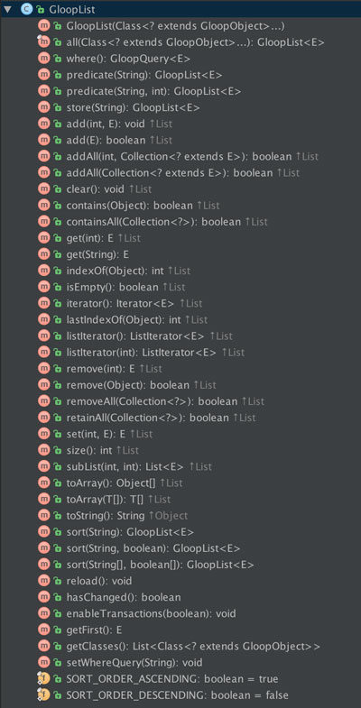

# GloopList

GloopList implements the `List` interface. It is an implementation of a List. The GloopList is a lazy loading list. Objects are only loaded if they are accessed.

## Architecture



## Methods

### Get GloopList

The `all` method takes as input one or more classes to load in the list. When the classes are passed the list isn't loaded. This happens the first time when an operation is called witch needs to load the data.

```java
List<Animal> animals = Gloop.all(Animal.class);

or

GloopList<Animal> animals = Gloop.all(Animal.class);
```
This will return a instance of a GloopList.

### Store

The `store` method takes as input one string, with the name of the store where the list loads the objects from.

```java
animals.store("animalStore");
```

### Where

```java
animals.where()
	.equalsTo("name", "Max")
	.and()
	.equalsTo("age", 3);
```

### Predicate

With the `predicate` method it is possible to pass SQL or NSPredicate queries and it will return a GloopList containing the objects from the query.

```java
animals.predicate("Select * from Animal where name = 'Alex'");
```

### Add element

```java
animals.add(new Animal());
```
This will add one animal to the database and the internal list. The passed object needs to be a GloopObject.

```java
animals.addAll(animalsCollection);
```
Adds every element of the passed collection to the list and database.
Every element of the list needs to be a GloopObject.

### Remove element

```java
animals.remove(animal);
```
This will delete the passed animal from the list and the local database. The object passed needs to be a GloopObject.

```java
animals.removeAll(animalsCollection);
```
This will remove all elements of the passed collection. Every element of the collection need to be a GloopObject.

```java
animals.clear();
```
This will delete every element of the list from the local database and the internal list.

### Contains
```java
boolean result = animals.contains(animals);
```
Contains will check if the passed object is inside the list or not. No objects are loaded. The passed object needs to be a GloopObject.

```java
boolean result = animals.containsAll(animalCollection);
```
This will check if all of the passed GloopObjects from the collection are in the list. If so than it will return `true` otherwise `false`.

### Size
```java
int size = animals.size();
```
This will return the size of the list.

### IsEmpty
```java
boolean result = animals.isEmpty();
```
Checks if the list is empty or not.

### Iterator
The iterator is used to iterate over the list. You can ad should use it like this:

```java
for (Animal animal : animals) {
	// do something
}
```
or

```java
Iterator<Animal> iterator = animals.iterator();
while (iterator.hasNext()) {
	// do something
}
```

### sort
To sort the list by a specific property use. By default the list is sorted `SORT_ORDER_ASCENDING` otherwise `SORT_ORDER_DESCENDING` need to be passed as second parameter.

```java
animals.sort("name");
```

```java
animals.sort("name", GloopList.SORT_ORDER_DESCENDING);
```

If the list should be sorted by more than one property, two arrays can be passed.
First parameter is a String array with the properties to sort. The second is the ordering of the first passed properties. Following example will sort the `Animal` list by property `name` ascending and the property `age` descending.

```java
animals.sort(
	new String[]{"name", "age"},
	new boolean[]{GloopList.SORT_ORDER_ASCENDING, GloopList.SORT_ORDER_DESCENDING});
```

### print 

Using the `print()` method of the GloopList it is possible to print the raw content of the database to the Android Logcat. The data stored get not deserialized and is printed, as it is saved, to the Logcat. 

Example:

```java
Gloop.all(Person.class)
	.where()
		.equalsTo("name", "alex")
	.all()
	.print();
```
output:

```
D/GloopSDK: ---------------------------------------
D/GloopSDK: /       name /        age /    friends / 
D/GloopSDK: ---------------------------------------
D/GloopSDK: /       alex /         25 /         [] / 
D/GloopSDK: ---------------------------------------

```

or

```java
Gloop.all(Person.class).print();
```
output:

```
D/GloopSDK: ------------------------------------------------------------------------
D/GloopSDK: /       name /        age /                                    friends / 
D/GloopSDK: ------------------------------------------------------------------------
D/GloopSDK: /       alex /         25 /                                         [] / 
D/GloopSDK: /       test /         30 /   ["c99963f7-b11c-4436-bb24-86601e8b7008"] / 
D/GloopSDK: ------------------------------------------------------------------------

```